# Multi-Tier AWS Architecture (Manual Deployment)

A hands-on project where I manually built a 3-tier AWS architecture from scratch — VPC networking, a public EC2 web server, a private RDS MySQL database, and an S3 bucket accessed via IAM role (no hardcoded credentials).

---

## 🧱 Architecture

```
                     Internet
                        │
                 ┌──────▼──────┐
                 │   Internet   │
                 │   Gateway    │
                 └──────┬──────┘
                        │
                ┌───────▼────────┐
                │  Public Subnet  │   10.0.1.0/24
                │  ┌───────────┐  │
                │  │   EC2     │  │
                │  │ (Apache)  │  │
                │  └─────┬─────┘  │
                └────────┼────────┘
                         │ (ec2-sg → rds-sg)
                ┌────────▼────────┐
                │  Private Subnet  │   10.0.2.0/24
                │  ┌────────────┐  │
                │  │ RDS MySQL  │  │
                │  └────────────┘  │
                └──────────────────┘

        EC2 also reads/writes to S3 via IAM Role
        (no access keys stored on the instance)
```

---

## 🛠️ What I Built

- **VPC** (`10.0.0.0/16`) with one public subnet and two private subnets (across 2 AZs, required for RDS subnet groups)
- **Internet Gateway** attached to the VPC, routed via a public route table
- **EC2 instance** (Ubuntu, t2.micro) in the public subnet running Apache
- **RDS MySQL instance** in the private subnet — no public access, reachable only from EC2
- **S3 bucket** with public access blocked, accessed from EC2 using an **IAM role** (no stored credentials)
- **Security Groups** scoped tightly: SSH only from my IP, MySQL only from the EC2 security group

---

## 📋 Steps Summary

| Stage             | What Happened                                                                                    |
| ----------------- | ------------------------------------------------------------------------------------------------ |
| 1. Network Layer  | Created VPC, public + private subnets, Internet Gateway, and route tables                        |
| 2. EC2 Web Server | Created security group, IAM role, launched EC2, installed Apache, SSH'd in                       |
| 3. RDS Database   | Created RDS security group, DB subnet group, launched private MySQL instance, connected from EC2 |
| 4. S3 + IAM       | Created private S3 bucket, accessed it from EC2 via IAM role instead of access keys              |
| 5. Cleanup        | Tore down all resources in dependency order to avoid charges                                     |

---

## 📸 Screenshots

### VPC & Networking

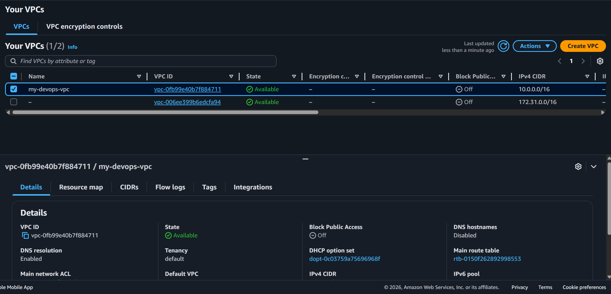
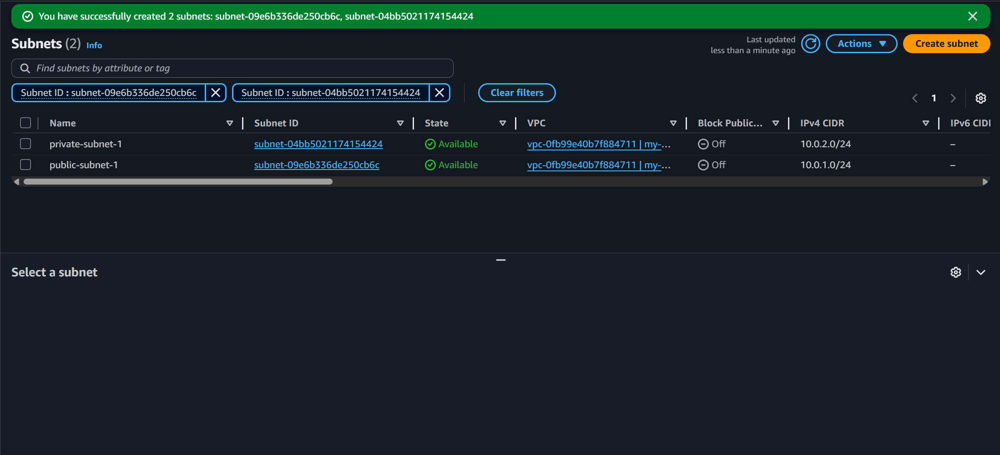

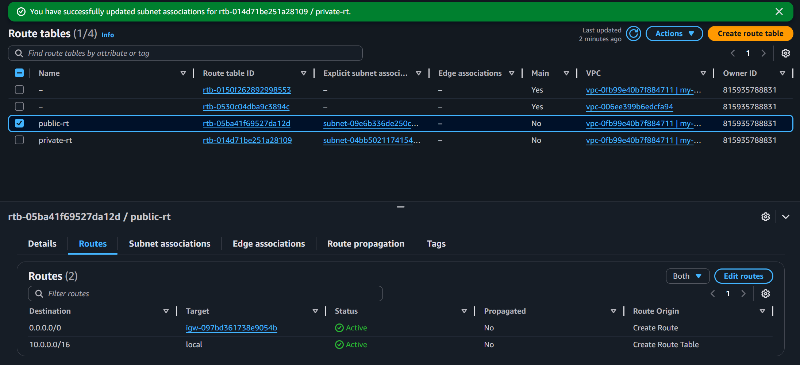

### EC2 Web Server

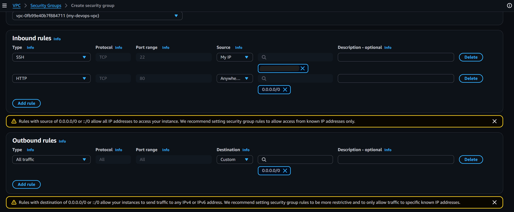
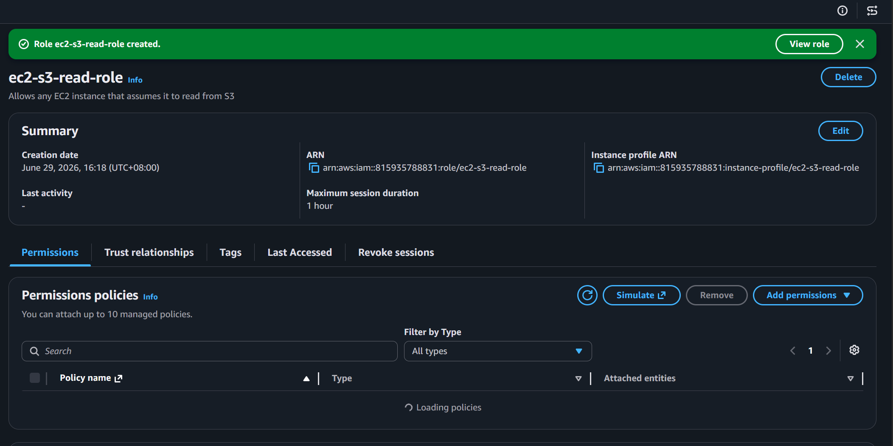
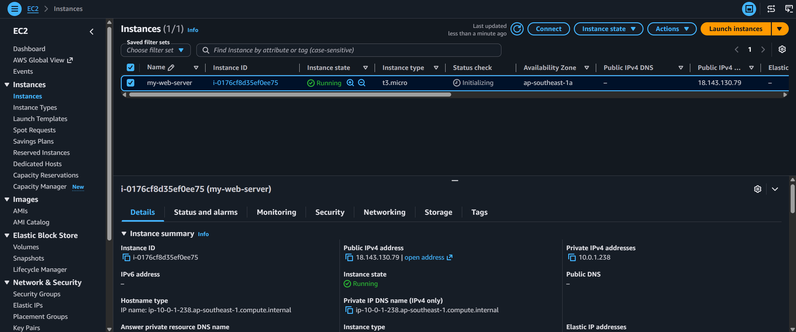
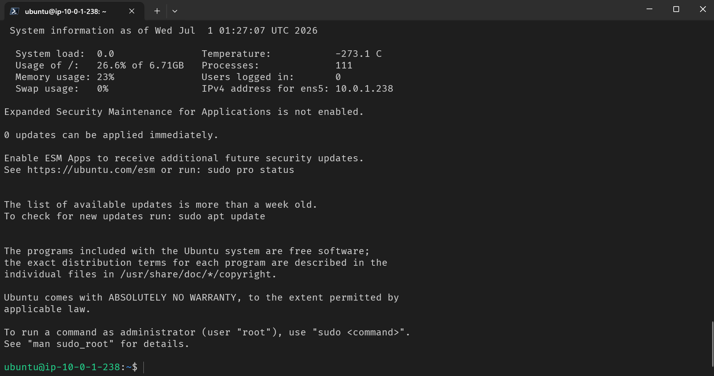
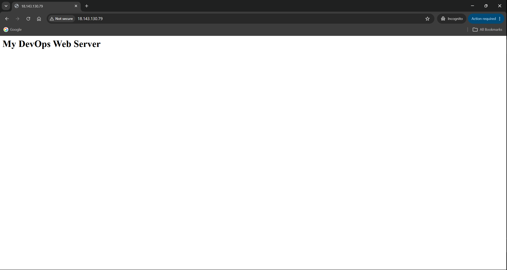

### RDS Database

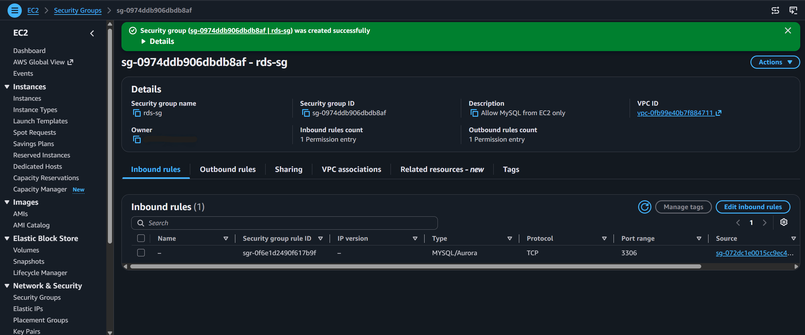
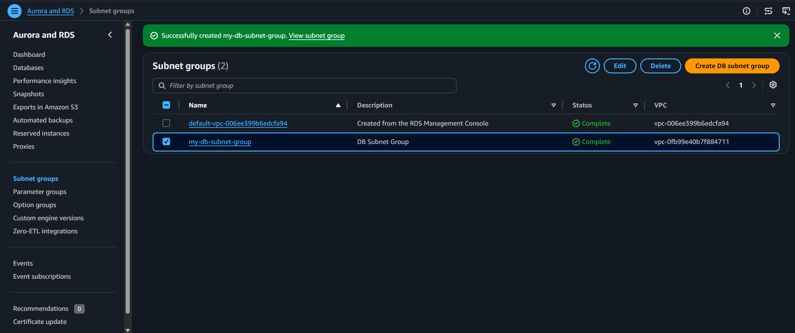
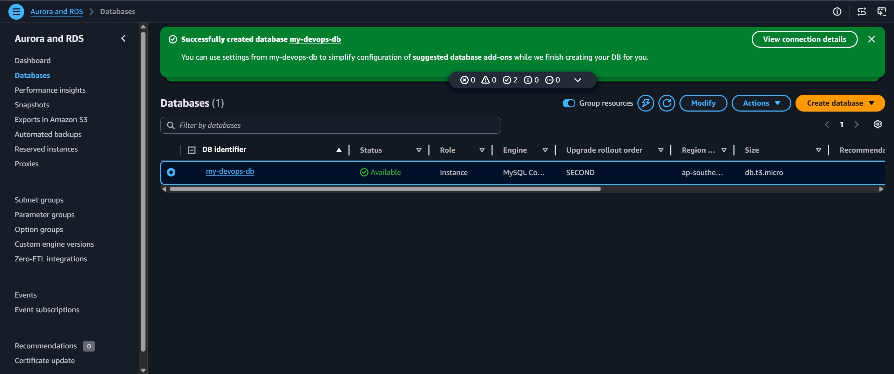
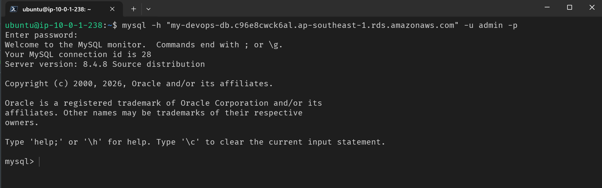
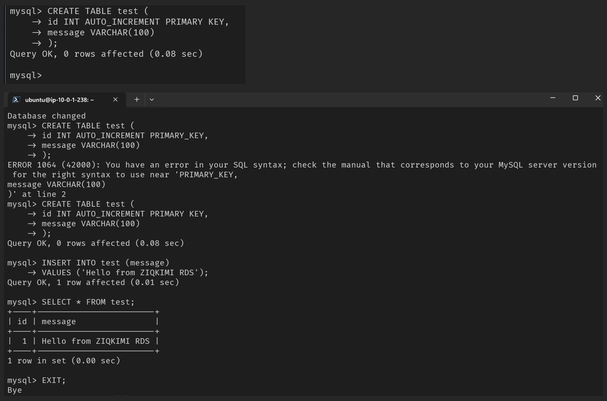

### S3 + IAM Role Access

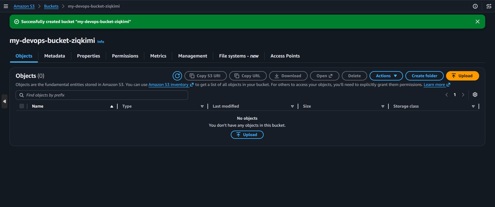
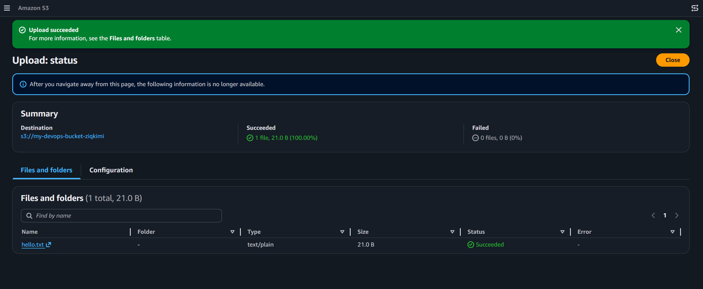
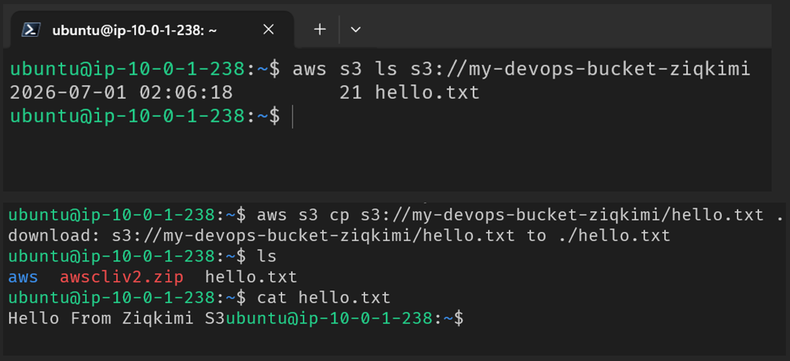

### Cleanup

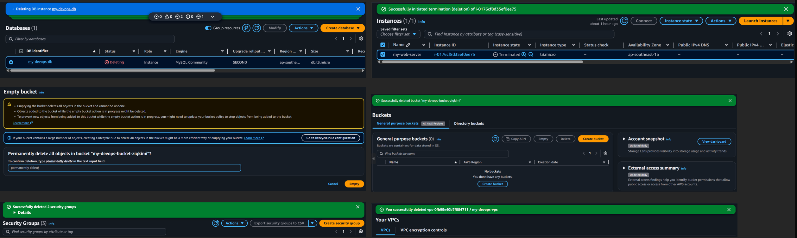

---

## 💡 Key Concepts Practiced

- Public vs. private subnets — and how route tables (not just labels) actually determine which is which
- Security groups as stateful, reference-based firewalls (referencing a security group as a source, not just an IP)
- IAM roles for EC2 → no hardcoded AWS credentials on the instance
- Why databases should never sit in a public subnet
- RDS subnet group requirements (minimum 2 AZs, even for single-AZ deployments)
- Proper AWS resource teardown order to avoid lingering charges

---

## 🧹 Cleanup Checklist

To avoid unexpected AWS charges, resources were deleted in this order:

1. RDS instance
2. EC2 instance
3. S3 bucket (emptied first)
4. VPC components (security groups → route tables → subnets → IGW → VPC)
5. IAM role
6. DB subnet group

---

## 🔜 Next Steps / Ideas for Further Practice

- [ ] Add a second EC2 instance behind an Application Load Balancer
- [ ] Enable S3 versioning
- [ ] Write a scoped IAM policy limited to a single bucket
- [ ] Enable RDS automated backups and test snapshot restore
